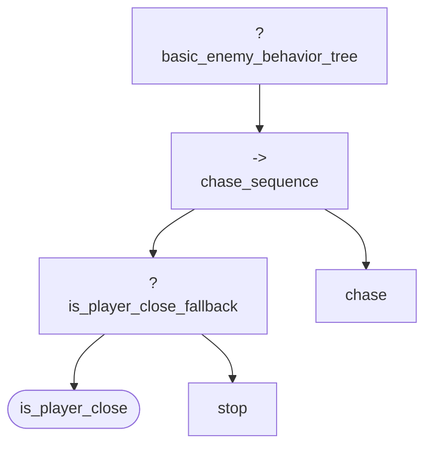

# Enemy Behavior

## basic_enemy_behavior_tree

```mermaid
flowchart TD
    root["?<br/>basic_enemy_behavior_tree"]
    chase_seq["-><br/>chase_sequence"]
    close_fallback["?<br/>is_player_close_fallback"]
    close(["is_player_close"])
    stop[stop]
    chase[chase]

    root --> chase_seq
    chase_seq --> close_fallback
    close_fallback --> close
    close_fallback --> stop
    chase_seq --> chase
```